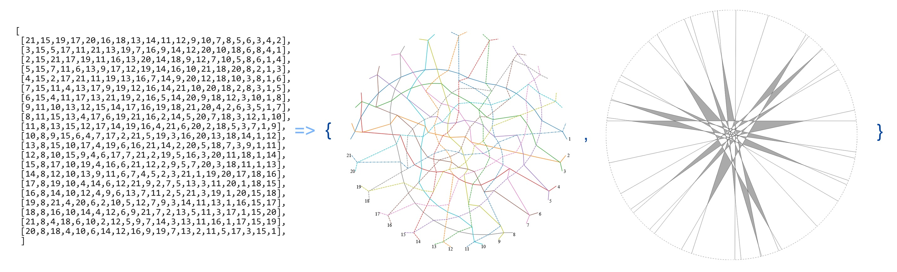
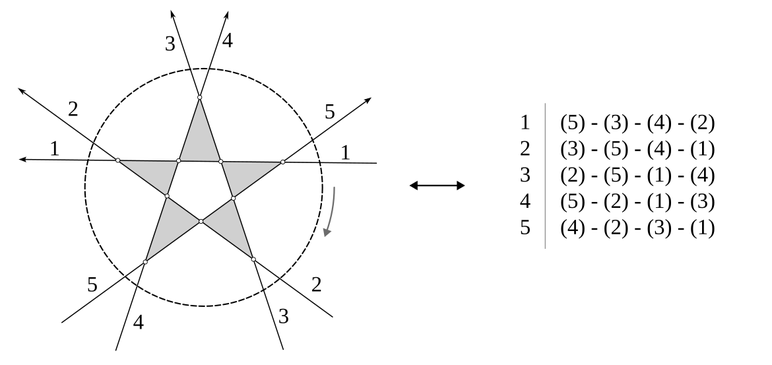

# LineOrder



[[paper]](https://arxiv.org/abs/2507.07951)

This small tool can help with finding an arrangement of straight lines that corresponds to a given arrangement of pseudolines (taking into account rotational or mirror symmetry). Also known as *straightening*.

Additionally, for a given arrangement of pseudolines, it can generate a beautiful SVG file with a circular visual representation of the arrangement. For a given set of straight lines, it can generate a visual representation of these arrangements, showing all the non-overlapping triangles.

Finally, this tool can generate bigger arrangements using existing one, or find arrangements in the form of `y = mi(x-ai)`, where `ai` are either very small values or `tan((+/-)i*pi/(N-1))` (see. [Gallery #2](https://zegalur.github.io/line-order/gallery/special.html) for some examples). These are special kinds of arrangements from the Proposition 3.1. from [this paper](https://www.researchgate.net/publication/1893173_On_simple_arrangements_of_lines_and_pseudo-lines_in_P2_and_R2_with_the_maximum_number_of_triangles).

## Showcases

- [Gallery #1](https://zegalur.github.io/line-order/gallery/kobon.html) - Kobon triangle problem solutions.
- [Gallery #2](https://zegalur.github.io/line-order/gallery/special.html) - Special solutions, suitable for Proposition 3.1.
- [Gallery #3](https://zegalur.github.io/line-order/gallery/local.html) - Local zoom-in projections to enhance the readability of small triangles.
- [Gallery #4](https://zegalur.github.io/line-order/gallery/other.html) - Other.
- [Kobon-CNF](https://github.com/zegalur/kobon-cnf) - SAT-based solver for the Kobon triangle problem using Kissat and LineOrder.

## How To Use

First, get a table of your arrangement. For more information about the table representation, see the next sections:

```python
# An optimal arrangement of 21 pseudo-lines with 133 triangles.
# Has a 3-fold rotational symmetry. (by P.Savchuk)

input_21 = [
    [21,15,19,17,20,16,18,13,14,11,12,9,10,7,8,5,6,3,4,2],
    [3,15,5,17,11,21,13,19,7,16,9,14,12,20,10,18,6,8,4,1],
    [2,15,21,17,19,11,16,13,20,14,18,9,12,7,10,5,8,6,1,4],
    [5,15,7,11,6,13,9,17,12,19,14,16,10,21,18,20,8,2,1,3],
    [4,15,2,17,21,11,19,13,16,7,14,9,20,12,18,10,3,8,1,6],
    [7,15,11,4,13,17,9,19,12,16,14,21,10,20,18,2,8,3,1,5],
    [6,15,4,11,17,13,21,19,2,16,5,14,20,9,18,12,3,10,1,8],
    [9,11,10,13,12,15,14,17,16,19,18,21,20,4,2,6,3,5,1,7],
    [8,11,15,13,4,17,6,19,21,16,2,14,5,20,7,18,3,12,1,10],
    [11,8,13,15,12,17,14,19,16,4,21,6,20,2,18,5,3,7,1,9],
    [10,8,9,15,6,4,7,17,2,21,5,19,3,16,20,13,18,14,1,12],
    [13,8,15,10,17,4,19,6,16,21,14,2,20,5,18,7,3,9,1,11],
    [12,8,10,15,9,4,6,17,7,21,2,19,5,16,3,20,11,18,1,14],
    [15,8,17,10,19,4,16,6,21,12,2,9,5,7,20,3,18,11,1,13],
    [14,8,12,10,13,9,11,6,7,4,5,2,3,21,1,19,20,17,18,16],
    [17,8,19,10,4,14,6,12,21,9,2,7,5,13,3,11,20,1,18,15],
    [16,8,14,10,12,4,9,6,13,7,11,2,5,21,3,19,1,20,15,18],
    [19,8,21,4,20,6,2,10,5,12,7,9,3,14,11,13,1,16,15,17],
    [18,8,16,10,14,4,12,6,9,21,7,2,13,5,11,3,17,1,15,20],
    [21,8,4,18,6,10,2,12,5,9,7,14,3,13,11,16,1,17,15,19],
    [20,8,18,4,10,6,14,12,16,9,19,7,13,2,11,5,17,3,15,1],
    ]
```

Generating a visual representation SVG of the arrangement of pseudolines:

```python
pseudolines_svg = lineorder.draw_pseudolines(input_21)
if pseudolines_svg['status'] == 'OK':
    result_svg = pseudolines_svg['svg']
    ...
```

Finding a set of straight lines for a given table (*straightening* the arrangement):

```python
straightened_arrangement = lineorder.find_lines(
    input_21, rotational_symmetry=3)
if straightened_arrangement['status'] == 'OK':
    result_lines = straightened_arrangement['lines']
    ...
```

Finally, generating a beautiful visuals for a resulting sets of line:

```python
result_svg = lineorder.draw_lines(result_lines)
if result_svg['status'] == 'OK':
    lines_arrangment_svg = result_svg['svg']
    ...
```

This will give you the results shown in the title image above. For more examples, see [Gallery](https://zegalur.github.io/line-order/gallery/kobon.html).

## Table Representation

Enclose all the cross points of the arrangement into a big circle. Then select one line as line #1. Go clockwise from the line #1 around the circle and numerate all the other lines that go into the circle as line #2, line #3, etc. Continue until you reach line #1.

Now you have numbered lines with the directions. For each line, write down the lines that are crossing this line in the order according to the line direction. You constructed an arrangement table.

This is how a table for a pentagram can look like:



For intersections with more than two lines, list all the lines that intersect with the current line and intersection point in the same order, starting from the current line.

For more examples, please visit the galleries above.

## How it Works

It is a surprisingly simple approach. It's not clear why it works so well for many complex cases. Below is a brief overview of the method. See the code for `solver` for more details.

### Unknown Variables

Each unknown line is represented by two unknown variables: `ai` (angle), and `Ci` (signed distance to the origin). Therefore, the line equation for the i-th line will be:

```math
x \cos{a_i} + y \sin{a_i} + C_i = 0, \ \ \ i=1,2,...,N
```

For a given line `i`, two consecutive entries `j` and `k` in the i-th table row tell us that line `j` must intersect line `i` before line `k` intersects line `i`. With `ai,aj,ak` and `Ci,Cj,Ck` this condition can be formulated using this inequality:

```math
S(i,j,k) \cdot F(i,j,k) < 0, \ \ \text{where} \ \ \\ 
F(i,j,k) = 
    C_i \cdot \sin(a_k - a_j) + 
    C_j \cdot \sin(a_i - a_k) + 
    C_k \cdot \sin(a_j - a_i)
```

At a multi-line intersection point, where three or more lines intersect at the same point, the inequalities above become equalities between the lines involved in this intersection.

`S(i,j,k)` is a special "sign-correction" function:

```python
def cmp_func(row, l1, l2):
    if l1 < row: l1 += N
    if l2 < row: l2 += N
    return l1 < l2

def S(row, l1, l2):
    s = 1.0 if l1 > l2 else -1.0
    s *= -1.0 if cmp_func(row, l1, l2) else 1.0
    return s
```

The other limitations is for line angles `ai` and signed distances `Ci`:

```math
a_i > a_{i+1}, \ \\ 
-\pi < a_i < 0, \ \\ 
A_{min} < |a_i - a_{i+1}| < A_{max}, \ \\ 
\ \\
C_{min} < C_i < C_{max}
```

In the summary for `N` lines, we have no more than `2*N` unknowns. The number of unknowns can be reduced if it is known that the arrangement has symmetries.

### Target Function

In its core, the solver works by minimizing a special *target function*. Smaller values of this function mean a smaller violation of the conditions.

Conditions for inequalities codified using:

```math
\text{LessThan}(x,v) = 
\begin{cases}
 0, & \text{ if } \ x < v \\
 (x-v)^2, & \text{ if } \ x >= v
\end{cases}
```

The target function is just a sum of `LessThan` functions with coefficients. Some conditions are codified directly as boundaries for the variables. 

Finally, using `scipy.optimize.minimize`, we are trying to get the minimum of the target function. Any set of variables that gives 0 is considered to be an ideal solution. But often even non-ideal solutions are actually perfectly fine solutions for the whole problem of straightening arrangements.

## Limitations

Works well for not very big odd numbers of lines with rotational or mirror symmetries. Current realization doesn't check if input values are all correct.

## Acknowledgments

This solver was created during the collaboration with Kyle Wood on Kobon Triangles. Special thanks to Kyle for providing complex test cases featuring mirror symmetry.

Written in Python 3.8 and uses `SciPy`, `NumPy` and `Matplotlib` libraries.

## References

* [Arrangement of lines (Wikipedia)](https://en.wikipedia.org/wiki/Arrangement_of_lines)
* [Kobon triangle problem (Wikipedia)](https://en.wikipedia.org/wiki/Kobon_triangle_problem)
* Bartholdi, Nicolas & Blanc, Jérémy & Loisel, Sébastien. *On simple arrangements of lines and pseudo-lines in P^2 and R^2 with the maximum number of triangles.* 2007. [(link)](https://www.researchgate.net/publication/1893173_On_simple_arrangements_of_lines_and_pseudo-lines_in_P2_and_R2_with_the_maximum_number_of_triangles)
* Weisstein, Eric W. "Kobon Triangle." From [MathWorld](https://mathworld.wolfram.com/)--A Wolfram Web Resource. https://mathworld.wolfram.com/KobonTriangle.html 
* Johannes Bader, ["Kobon Triangles"](https://web.archive.org/web/20160303180311/http://www.tik.ee.ethz.ch/sop/people/baderj/?page=other.php)

## License

This work is licensed under CC BY 4.0<br>
*Pavlo Savchuk 2024-2025*
